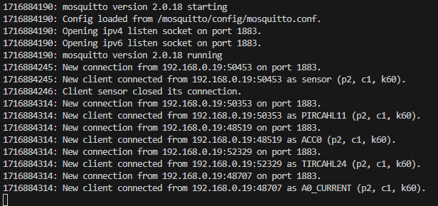

# <em>Отчёт</em>
## Студент Зайков Матвей, группа 5142704/30801
<br/>

# 1. Разработка Simulator для генерации данных
В файле ```sensor.py``` создадим новый тип датчиков <em>Acceleration</em>, способный измерять величину ускорения.

```python
class Acceleration(Sensor):
    step = 0

    def __init__(self, name):
        super().__init__(name)
        self.type = "acceleration"

    def generate_new_value(self):
        import math
        self.value = 7 * math.sin(self.step)
```

Код клиента из ```main.py```, который подключается к mqtt брокеру и публикует сообщения:
```python
import paho.mqtt.client as paho
from os import environ
import time

from entity.sensor import *

broker = "localhost" if "SIM_HOST" not in environ.keys() else environ["SIM_HOST"]
port = 1883 if "SIM_PORT" not in environ.keys() else int(environ["SIM_PORT"])
name = "sensor" if "SIM_NAME" not in environ.keys() else environ["SIM_NAME"]
period = 1 if "SIM_PERIOD" not in environ.keys() else int(environ["SIM_PERIOD"])
type_sim = "temperature" if "SIM_TYPE" not in environ.keys() else environ["SIM_TYPE"]
sensors = {"temperature": Temperature, "pressure": Pressure, "current": Current}


def on_publish(client, userdata, result):  # create function for callback
    print(f"data published {userdata}")
    pass


sensor = sensors[type_sim](name=name)
client1 = paho.Client(sensor.name)  # create client object
client1.on_publish = on_publish  # assign function to callback
client1.connect(broker, port)  # establish connection
while True:
    sensor.generate_new_value()
    ret = client1.publish("sensors/" + sensor.type + "/" + sensor.name, sensor.get_data())  # publish
    time.sleep(period)
```

В Dockerfile укажем следующие инструкции для создания образа:
```
FROM python:alpine3.19
WORKDIR /app
COPY requirements.txt .
RUN pip install -r requirements.txt
COPY . .
CMD ["python", "main.py"]
```

В ```requirements.txt``` укажем:
```
paho_mqtt==1.6.1
```

Добавим текущего пользователя машины в группу docker с помощью
```
sudo usermod -aG docker $USER
```
Выполним это на трёх машинах для <em>client</em>, <em>gateway</em> и <em>server</em>

Теперь можно приступать к билду образа:
```
docker build -t matveeey/data-simulator .
```


Сборка прошла успешно. Можно переходить к следующему этапу.

# 2. Запуск Mosquitto брокера
Для настройки MQTT необходимо создать конфиг mosquitto.conf:
```
listener 1883
allowanonymous true
```
Создадим docker-compose.yml для gateway:
```
version: '3'
services:
  broker:
    image: eclipse-mosquitto
    container_name: broker
    volumes:
      - ./mosquitto/mosquitto.conf:/mosquitto/config/mosquitto.conf
    ports:
      - "1883:1883"
```
Настроим нужный нам проброс пакетов:
```
sudo iptables -A OUTPUT -o enp0s8 -p tcp --syn --dport 1883 -m conntrack --ctstate NEW,ESTABLISHED,RELATED -j ACCEPT
sudo iptables -A OUTPUT -o enp0s9 -p tcp --syn --dport 1883 -m conntrack --ctstate NEW,ESTABLISHED,RELATED -j ACCEPT
sudo iptables -A INPUT -i enp0s8 -p tcp --syn --dport 1883 -m conntrack --ctstate NEW,ESTABLISHED,RELATED -j ACCEPT
sudo iptables -A INPUT -i enp0s9 -p tcp --syn --dport 1883 -m conntrack --ctstate NEW,ESTABLISHED,RELATED -j ACCEPT
```
И сохраним настройки под рутом
```
iptables-save > /etc/iptables/rules.v4
ip6tables-save > /etc/iptables/rules.v6
```
Запустим наш контейнер:


Брокер запущен и работает.

Теперь запустим на клиенте симуляторы датчиков:


На брокер прилетают пакеты:




# 2. Отображение данных
## Telegraf
Настроим Telegraf, который будет подписываться на MQTT с данными от датчиков:
